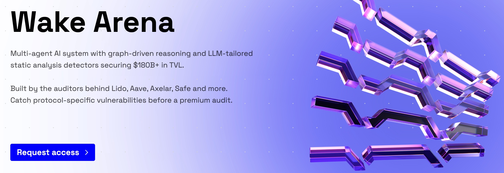

# Public Wake Arena AI reports

This repository collects **Wake Arena AI reports** that have been published by our clients.

- **Request access**: [Wake Arena](https://ackee.xyz/wake/arena)
- **Looking for manual audit reports instead?** See [Ackee-Blockchain/public-audit-reports](https://github.com/Ackee-Blockchain/public-audit-reports).

## About Wake Arena

[Wake Arena](https://ackee.xyz/wake/arena) is a **multi-agent AI security system** with **graph-driven reasoning** and **LLM-tailored static analysis detectors** to help teams catch vulnerabilities **before** a premium audit.

Built by the auditors behind **Lido, Aave, Axelar, Safe** and more (Ackee Blockchain Security). Wake Arena is powered by the **Wake Framework**.

## Why teams use it

- **Pre-audit preparation**: catch surface-level issues early and focus human auditors on deeper protocol logic.
- **Continuous security**: scan every PR, upgrade, or release to reduce security debt.
- **Third-party integration**: assess risk in external Solidity code before integrating tokens, oracles, or dependencies.

## How it works

1. **Upload/connect a Solidity codebase** (or target a branch/repo).
2. Run the **AI-driven audit pipeline**: detector signals + multi-step reasoning guided by dependency graphs.
3. **Get a report** with findings, severity, and remediation guidance.
4. **Fix, then audit** (arrive to a manual audit with cleaner code).

## Proven results

Wake Arena combines **108 detectors** with deep reasoning to cover issues that pattern-based tooling often misses. On the Wake Arena landing page you can find benchmark breakdowns and reported metrics, including:

- Detected **43 / 94** high-severity issues across historical audit competition benchmarks
- **33% of all reported findings** and **50% of critical findings** discovered (across benchmarks and production audits)

For details, see the [launch blog post](https://ackee.xyz/blog/wake-arena-multi-agent-ai-audit-with-graph-driven-reasoning/).

## Report contents

Each audit report typically includes:

- The **findings classification** used throughout the report
- **Executive summary** highlighting the key insights
- A list of **findings** (with severity and remediation guidance)

Reports are organized into folders within this repository (layout may vary over time).

## Notes & disclaimers

- Reports reflect the **state of the codebase at the time of the audit** and within the **agreed scope**.
- Security is not a one-time event—treat reports as one input into an ongoing security process.

## Repository contents

- Reports are stored by year (e.g. `2025/`, `2026/`)
- Each report PDF has a matching signature file: `.pdf.sig`

## Verifying report signatures

Reports have a signature that can be used to verify that the PDF has not been modified when downloaded from a source other than this repository.

- Download the [public.key](public.key) file from this repository.
- Import it with `gpg` and verify:

```bash
gpg --import public.key
gpg --verify <report>.pdf.sig <report>.pdf
```
